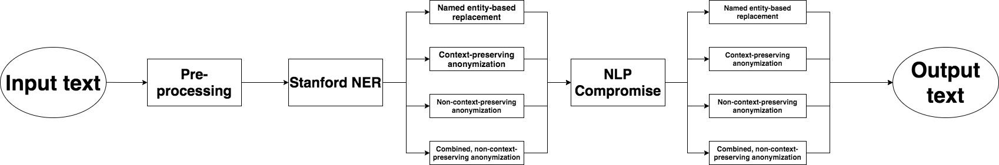

Both authors contributed equally to the development of this tool and are listed in alphabetical order.

# Summary

Netanos (named entity-based text anonymization for open science) is a natural language processing software that anonymizes texts by identifying and replacing named entities. The key feature of Netanos is that the anonymization preserves context that allow linguistic analyses on anonymized texts. Consider the example string “Max and Ben spent more than 1000 hours on writing the software. They started in August 2016 in Amsterdam.”

Its architecture relies on two software libraries capable of identifying named entities. (1) The Stanford Named Entity Recognizer (NER, Finkel et al., 2005) integrated with the ner Node.js package (Srivastava, 2016), and (2) the NLP-compromise JavaScript frontend-library (Kelly, 2016). Both libraries are used in a layered architecture (see Figure 1) to identify persons (e.g. “Max”, “Ben”), locations (e.g. “Amsterdam”, “Munich”), organizations (e.g. “Google”), dates (e.g. “August 2016”), and values (e.g. “42”).

Specifically, the text anonymization is achieved with the following stepwise procedure:

* The input string is analyzed by Stanford's NER, identifying organizations, locations, persons, and dates.
* All identified entities are replaced with their context-preserving anonymized versions
* NLP-compromise's named entity recognition tool is applied to identify potentially remaining, unrecognized entities

Besides the key feature of context preserving text anonymization, Netanos also provides three alternative anonymization types. All anonymization types are illustrated below:

1. **Context-preserving replacement** (key feature)

   Identified named entity types are replaced with a composite string consisting of the entity type and the corresponding index of occurrence“[PERSON_1] and [PERSON_2] spent more than [DATE/TIME_1] on writing the software. They started in [DATE/TIME_2] in [LOCATION_1].”

2. **Named entity-based replacement**

   Identified entities are replaced with a different, randomly chosen named entity of the same type.“Barry and Rick spent more than 997 hours on writing the software. They started in January 14 2016 in Odessa.”

3. **Non-context preserving replacement**

   This replacement type is inspired by the anonymization procedure suggested by the UK Data Service. It replaces all strings having a capital first letter and all numeric values with XXX.“XXX and XXX spent more than XXX hours on writing the software. XXX started in XXX XXX in XXX.”

4. **Combined, non-context preserving anonymization**

   The context-preserving replacement (1.) is used to identify candidates for replacement that are then replaced with the procedure of the non-context preserving replacement (3.)“XXX and XXX spent more than XXX XXX on writing the software. XXX started in XXX XXX in XXX.”Note that all replacements are applied globally across the input string.

   ​

###  Technical Pipeline

The software follows the technical procedure described in the below pipeline:

# References

* Kelly, S. NLP Compromise (2016), GitHub repository, https://github.com/nlp- compromise/compromise
* Nikhil Srivastava . ner (2016), GitHub repository, https://github.com/niksrc/ner
* Finkel, J. R., Grenager, T. & Manning, C. (2005, June). Incorporating non-local information into information extraction systems by gibbs sampling. In Proceedings of the 43rd annual meeting on association for computational linguistics (pp. 363-370). Association forComputational Linguistics.
* UK Data Service (https://bitbucket.org/ukda/ukds.tools.textanonhelper/wiki/Home)**
